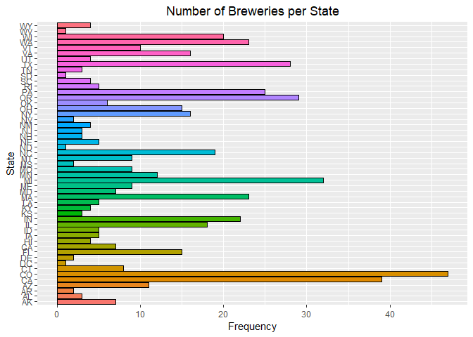
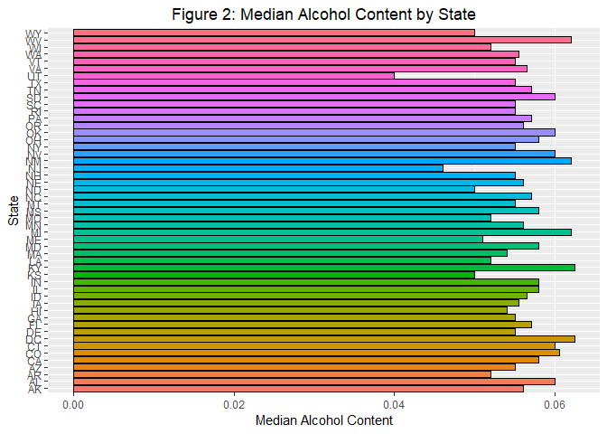
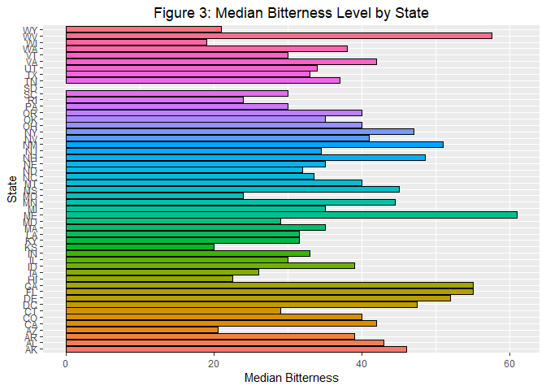
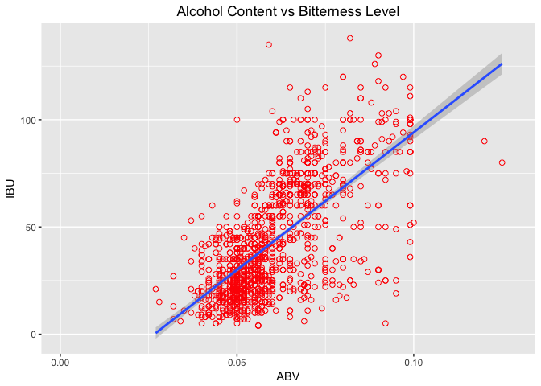

### Introduction
We analyzed two data sets, one containing information about breweries across the US and one containing information about types of beers, to look at the distrubution of breweries per state. We also focused on the international betterness unit (IBU) and alchohol level to see which states have the highest IBU and alchol content and if there is a correlation between the two variables.
</br>

We used the following R packages in the course of this analysis: plyr, dplyr, and ggplot2.

```r
library(plyr)
library(dplyr)
```

```
## 
## Attaching package: 'dplyr'
```

```
## The following objects are masked from 'package:plyr':
## 
##     arrange, count, desc, failwith, id, mutate, rename, summarise,
##     summarize
```

```
## The following objects are masked from 'package:stats':
## 
##     filter, lag
```

```
## The following objects are masked from 'package:base':
## 
##     intersect, setdiff, setequal, union
```

```r
library(ggplot2)
library(knitr)
```
</br>


First, we will look at the number of breweries in each state. After we imported the brewery data, we counted the number of breweries that are located in each state. We put the information in a histogram, which is shown below. Colorado and California have the highest number of breweries of all states.

```r
Breweries <- read.csv("Breweries.csv", header=TRUE)
BreweriesPerState <- count(Breweries, State)
BpS <- ggplot(data=BreweriesPerState, aes(x=State, y=n, fill=State)) + 
  geom_bar(stat='identity', colour = 'black') +
  coord_flip() + 
  ggtitle("Number of Breweries per State") + ylab("Frequency") +
  theme(legend.position="none") +
  theme(plot.title = element_text(hjust = 0.5))
BpS
```

<!-- -->
</br>


After importing the beer data, we merged the two data sets together on the variable Brew_ID. This variable contains the specific ID numbers for each brewery and is a variable that both data sets have. The first and last 6 lines of the merged data set are shown below to show the merged data set.

```r
Beers <- read.csv("Beers.csv", header=TRUE)
colnames(Beers)[5] <- "Brew_ID"
BrewsandBeers <- merge(Beers, Breweries, by = "Brew_ID")
colnames(BrewsandBeers)[2] <- "BeerName"
colnames(BrewsandBeers)[8] <- "BrewerieName"
kable(head(BrewsandBeers), caption="First 6 Lines")
```


Table: First 6 Lines

 Brew_ID  BeerName         Beer_ID     ABV   IBU  Style                                  Ounces  BrewerieName        City          State 
--------  --------------  --------  ------  ----  ------------------------------------  -------  ------------------  ------------  ------
       1  Get Together        2692   0.045    50  American IPA                               16  NorthGate Brewing   Minneapolis   MN    
       1  Maggie's Leap       2691   0.049    26  Milk / Sweet Stout                         16  NorthGate Brewing   Minneapolis   MN    
       1  Wall's End          2690   0.048    19  English Brown Ale                          16  NorthGate Brewing   Minneapolis   MN    
       1  Pumpion             2689   0.060    38  Pumpkin Ale                                16  NorthGate Brewing   Minneapolis   MN    
       1  Stronghold          2688   0.060    25  American Porter                            16  NorthGate Brewing   Minneapolis   MN    
       1  Parapet ESB         2687   0.056    47  Extra Special / Strong Bitter (ESB)        16  NorthGate Brewing   Minneapolis   MN    

```r
kable(tail(BrewsandBeers), caption = "Last 6 Lines")
```


Table: Last 6 Lines

        Brew_ID  BeerName                     Beer_ID     ABV   IBU  Style                      Ounces  BrewerieName                    City            State 
-----  --------  --------------------------  --------  ------  ----  ------------------------  -------  ------------------------------  --------------  ------
2405        556  Pilsner Ukiah                     98   0.055    NA  German Pilsener                12  Ukiah Brewing Company           Ukiah           CA    
2406        557  Heinnieweisse Weissebier          52   0.049    NA  Hefeweizen                     12  Butternuts Beer and Ale         Garrattsville   NY    
2407        557  Snapperhead IPA                   51   0.068    NA  American IPA                   12  Butternuts Beer and Ale         Garrattsville   NY    
2408        557  Moo Thunder Stout                 50   0.049    NA  Milk / Sweet Stout             12  Butternuts Beer and Ale         Garrattsville   NY    
2409        557  Porkslap Pale Ale                 49   0.043    NA  American Pale Ale (APA)        12  Butternuts Beer and Ale         Garrattsville   NY    
2410        558  Urban Wilderness Pale Ale         30   0.049    NA  English Pale Ale               12  Sleeping Lady Brewing Company   Anchorage       AK    
</br>


For each variable in the merged data set, the number of missing data points are summed. The results are listed in the table below. Note that IBU has a very high number of missing data points compared to alcohol content (ABV).

```r
na_counts <- sapply(BrewsandBeers, function(y) sum(is.na(y)))
kable(na_counts, caption = "The Number of Missing Data for each Variable")
```


Table: The Number of Missing Data for each Variable

                   x
-------------  -----
Brew_ID            0
BeerName           0
Beer_ID            0
ABV               62
IBU             1005
Style              0
Ounces             0
BrewerieName       0
City               0
State              0
</br>


Next, we group the merged data by state and then find the median alcohol content and bitterness for each state. We don't take into account the missing data points when finding the median. Then the median ABV and IBU for each state are displayed in the histograms below. It seems like the median alcohol content varies less by state than the median bitterness does.

```r
MedianbyState <- group_by(BrewsandBeers, State) %>%
summarise(median_ABV = median(ABV, na.rm=TRUE),
median_IBU = median(IBU, na.rm=TRUE))

bp_ABV <- ggplot(data=MedianbyState, aes(x=State, y=median_ABV, fill=State)) +
  geom_bar(stat='identity', colour = 'black') +
  coord_flip() + 
  ggtitle("Median Alcohol Content by State") + ylab("Median Alcohol Content") +
  theme(legend.position="none") +
  theme(plot.title = element_text(hjust = 0.5))

bp_IBU <- ggplot(data=MedianbyState, aes(x=State, y=median_IBU, fill=State)) +
  geom_bar(stat='identity', colour = 'black') +
  coord_flip() + 
  ggtitle("Median Bitterness Level by State") + ylab("Median Bitterness") +
  theme(legend.position="none") +
  theme(plot.title = element_text(hjust = 0.5))

bp_ABV
```

<!-- -->

```r
bp_IBU
```

```
## Warning: Removed 1 rows containing missing values (position_stack).
```

<!-- -->
</br>


We calculate the maximum alcohol content and bitterness level out of all of the different beers to see which state has the highest ABV and IBU. Oregan has the higest alcohol content at 0.128 and Oregan has the highest bitterness at 138.

```r
MaxABVState <- select(BrewsandBeers, State, ABV) %>%
slice(which.max(ABV))
MaxIBUState <- select(BrewsandBeers, State, IBU) %>%
slice(which.max(IBU))

kable(MaxABVState)
```


State      ABV
------  ------
CO       0.128

```r
kable(MaxIBUState)
```


State    IBU
------  ----
OR       138
</br>


Below are summary statistics for the alcohol content of all beers in the data set. These statistics include the minimum, maximum, mean, and median, among others.

```r
summary(BrewsandBeers$ABV)
```

```
##    Min. 1st Qu.  Median    Mean 3rd Qu.    Max.    NA's 
## 0.00100 0.05000 0.05600 0.05977 0.06700 0.12800      62
```
</br>


There seems to be a correlation between variables. As the alcohol content increases, 
so does the bitterness level. The state of Oregon has the highest recorded bitterness level. This could also mean that Orgeon has one of the highest levels of alcohol content given there seems to be a correlation between bitterness and alcohol levels.

```r
sp <- ggplot(BrewsandBeers, aes(x=ABV, y=IBU)) + 
  geom_point(pch = 21, size = 2, color="red") +
  geom_smooth(method="lm") + 
  ggtitle("Alcohol Content vs Bitterness Level") +
  theme(plot.title = element_text(hjust = 0.5))
  

suppressWarnings(print(sp))
```

<!-- -->
</br>


Conculsion
#Write conclusion here.
</br>


Master Branch
https://github.com/MeredithLudlow/DDS-CaseStudy1.git

Forked Master Branch
https://github.com/bbal20/DDS-CaseStudy1.git


