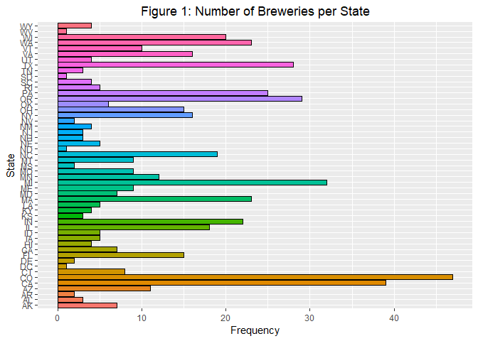
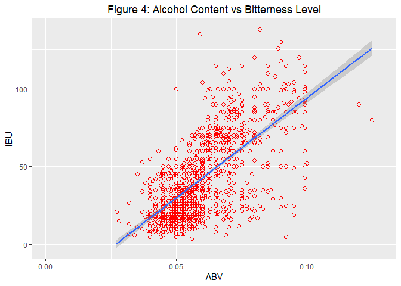
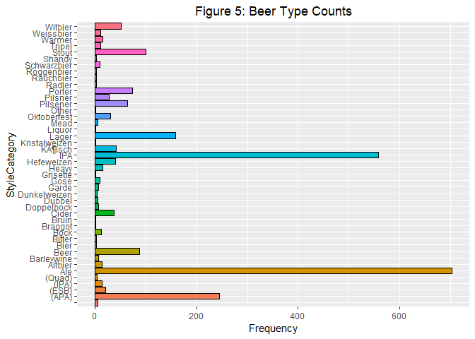

### Introduction
We analyzed two data sets, one containing information about breweries across the US and one containing information about differnt types of beers, to look at the distrubution of breweries per state. We also focused on the international bitterness unit (IBU) and alchohol level (ABV) to see which states have the highest bitterness level and alcohol content and if there is a correlation between the two variables.
</br>

We used the following R packages in the course of this analysis: plyr, dplyr, ggplot2, knitr, and stringr.

```r
library(plyr)
library(dplyr)
```

```
## 
## Attaching package: 'dplyr'
```

```
## The following objects are masked from 'package:plyr':
## 
##     arrange, count, desc, failwith, id, mutate, rename, summarise,
##     summarize
```

```
## The following objects are masked from 'package:stats':
## 
##     filter, lag
```

```
## The following objects are masked from 'package:base':
## 
##     intersect, setdiff, setequal, union
```

```r
library(ggplot2)
library(knitr)
library(stringr)
```
</br>


First, we looked at the number of breweries in each state. After we imported the brewery data, we counted the number of breweries that are located in each state. The results are shown in Figure 1 below. Colorado and California have the highest number of breweries out of all states.

```r
# Download the data set on breweries
Breweries <- read.csv("Breweries.csv", header=TRUE)
# Count the number of breweries in each state
BreweriesPerState <- count(Breweries, State)
# Make a histogram of the number of breweries in each state
BpS <- ggplot(data=BreweriesPerState, aes(x=State, y=n, fill=State)) + 
  geom_bar(stat='identity', colour = 'black') +
  coord_flip() + 
  ggtitle("Figure 1: Number of Breweries per State") + ylab("Frequency") +
  theme(legend.position="none") +
  theme(plot.title = element_text(hjust = 0.5))
BpS
```

<!-- -->
</br>


After importing the beer data, we merged the two data sets together on the variable Brew_ID. This variable contains the specific ID numbers for each brewery and is a variable that both data sets have. Table 1 and Table 2 show the first and last 6 lines respectively of the merged data set.

```r
# Download data set on beer
Beers <- read.csv("Beers.csv", header=TRUE)
# Rename the variable Brewery_ID to Brew_ID in the beer data set to match the variable in the brewery data set.
colnames(Beers)[5] <- "Brew_ID"
# Merge data sets
BrewsandBeers <- merge(Beers, Breweries, by = "Brew_ID")
# Rename columns
colnames(BrewsandBeers)[2] <- "BeerName"
colnames(BrewsandBeers)[8] <- "BrewerieName"
# Create tables for the first and last 6 lines of the merged data set
kable(head(BrewsandBeers), caption="Table 1: First 6 Lines")
```


Table: Table 1: First 6 Lines

 Brew_ID  BeerName         Beer_ID     ABV   IBU  Style                                  Ounces  BrewerieName        City          State 
--------  --------------  --------  ------  ----  ------------------------------------  -------  ------------------  ------------  ------
       1  Get Together        2692   0.045    50  American IPA                               16  NorthGate Brewing   Minneapolis   MN    
       1  Maggie's Leap       2691   0.049    26  Milk / Sweet Stout                         16  NorthGate Brewing   Minneapolis   MN    
       1  Wall's End          2690   0.048    19  English Brown Ale                          16  NorthGate Brewing   Minneapolis   MN    
       1  Pumpion             2689   0.060    38  Pumpkin Ale                                16  NorthGate Brewing   Minneapolis   MN    
       1  Stronghold          2688   0.060    25  American Porter                            16  NorthGate Brewing   Minneapolis   MN    
       1  Parapet ESB         2687   0.056    47  Extra Special / Strong Bitter (ESB)        16  NorthGate Brewing   Minneapolis   MN    

```r
kable(tail(BrewsandBeers), caption = "Table 2: Last 6 Lines")
```


Table: Table 2: Last 6 Lines

        Brew_ID  BeerName                     Beer_ID     ABV   IBU  Style                      Ounces  BrewerieName                    City            State 
-----  --------  --------------------------  --------  ------  ----  ------------------------  -------  ------------------------------  --------------  ------
2405        556  Pilsner Ukiah                     98   0.055    NA  German Pilsener                12  Ukiah Brewing Company           Ukiah           CA    
2406        557  Heinnieweisse Weissebier          52   0.049    NA  Hefeweizen                     12  Butternuts Beer and Ale         Garrattsville   NY    
2407        557  Snapperhead IPA                   51   0.068    NA  American IPA                   12  Butternuts Beer and Ale         Garrattsville   NY    
2408        557  Moo Thunder Stout                 50   0.049    NA  Milk / Sweet Stout             12  Butternuts Beer and Ale         Garrattsville   NY    
2409        557  Porkslap Pale Ale                 49   0.043    NA  American Pale Ale (APA)        12  Butternuts Beer and Ale         Garrattsville   NY    
2410        558  Urban Wilderness Pale Ale         30   0.049    NA  English Pale Ale               12  Sleeping Lady Brewing Company   Anchorage       AK    
</br>


For each variable in the merged data set, the number of missing data points was summed. The results are listed in the Table 3 shown below. Note that IBU has a very high number of missing data points compared to ABV.

```r
# Count the number of NA's in each variable in the merged data set
na_counts <- sapply(BrewsandBeers, function(y) sum(is.na(y)))
# Create a table for the number of NA's in each variable
kable(na_counts, caption = "Table 3: The Number of Missing Data for each Variable")
```


Table: Table 3: The Number of Missing Data for each Variable

                   x
-------------  -----
Brew_ID            0
BeerName           0
Beer_ID            0
ABV               62
IBU             1005
Style              0
Ounces             0
BrewerieName       0
City               0
State              0
</br>


Next, we grouped the merged data by state and then found the median alcohol content and bitterness for each state. We didn't take into account the missing data points when finding the median. The median ABV and IBU for each state are displayed in Figures 2 and 3 respectively. It seems like the median alcohol content varies less by state than the median bitterness does.

```r
# Group the data by state and find the median ABV and IBU for each state
MedianbyState <- group_by(BrewsandBeers, State) %>%
summarise(median_ABV = median(ABV, na.rm=TRUE),
median_IBU = median(IBU, na.rm=TRUE))
# Create a histogram for the median ABV by state
bp_ABV <- ggplot(data=MedianbyState, aes(x=State, y=median_ABV, fill=State)) +
  geom_bar(stat='identity', colour = 'black') +
  coord_flip() + 
  ggtitle("Figure 2: Median Alcohol Content by State") + ylab("Median Alcohol Content") +
  theme(legend.position="none") +
  theme(plot.title = element_text(hjust = 0.5))
# Create a histogram for the median IBU by state
bp_IBU <- ggplot(data=MedianbyState, aes(x=State, y=median_IBU, fill=State)) +
  geom_bar(stat='identity', colour = 'black') +
  coord_flip() + 
  ggtitle("Figure 3: Median Bitterness Level by State") + ylab("Median Bitterness") +
  theme(legend.position="none") +
  theme(plot.title = element_text(hjust = 0.5))

suppressWarnings(print(bp_ABV))
```

<!-- -->

```r
suppressWarnings(print(bp_IBU))
```

<!-- -->
</br>


We calculate the maximum alcohol content and bitterness level out of all of the different beers to see which state has the highest ABV and IBU. Tables 4 and 5 show the state with the maximum ABV and IBU respectively. Colorado has the higest alcohol content at 0.128 and Oregan has the highest bitterness at 138.

```r
# Find the beers with the highest ABV and IBU
MaxABVState <- select(BrewsandBeers, State, ABV) %>%
slice(which.max(ABV))
MaxIBUState <- select(BrewsandBeers, State, IBU) %>%
slice(which.max(IBU))
# Create a table showing the state with the maximum IBU and ABV
kable(MaxABVState, caption = "Table 4: State with the highest Alcohol Content")
```


Table: Table 4: State with the highest Alcohol Content

State      ABV
------  ------
CO       0.128

```r
kable(MaxIBUState,  caption = "Table 5: State with the highest Bitterness Level")
```


Table: Table 5: State with the highest Bitterness Level

State    IBU
------  ----
OR       138
</br>


Below are summary statistics for the alcohol content of all beers in the data set. These statistics include the minimum, maximum, mean, and median, among others and are shown below.

```r
# Summary satistics of ABV
summary(BrewsandBeers$ABV)
```

```
##    Min. 1st Qu.  Median    Mean 3rd Qu.    Max.    NA's 
## 0.00100 0.05000 0.05600 0.05977 0.06700 0.12800      62
```
</br>


Figure 4 displays a scatterplot that plots ABV and IBU values. There seems to be a positive correlation between IBU and ABV. As the alcohol content increases, so does the bitterness level. The state of Oregon has the highest recorded bitterness level. This could also mean that Orgeon has one of the highest levels of alcohol content given there seems to be a correlation between bitterness and alcohol levels.

```r
# Create a scatterplot of ABV vs. IBU
sp <- ggplot(BrewsandBeers, aes(x=ABV, y=IBU)) + 
  geom_point(pch = 21, size = 2, color="red") +
  geom_smooth(method="lm") + 
  ggtitle("Figure 4: Alcohol Content vs Bitterness Level") +
  theme(plot.title = element_text(hjust = 0.5))
  

suppressWarnings(print(sp))
```

<!-- -->
</br>

We created an additional variable that captures the beer type from the string values found in the Style column. Figure 5 shows the number of each style of beer. Ale and IPA are the most popular beer types followed by APA, Lager and Stout. Table 6 displays the top 10 most common beer types. It would be interesting to better understand what areas of the country contribute to this popularity. Also, there may be more demand for beer styles that aren't being currently produced by local breweries. Deeper analysis is required to answer these questions and others. 

```r
# Create new column from the information in the Style variable
BrewsandBeers$StyleCategory <- word(BrewsandBeers$Style,-1)
# Group the data by StyleCategory and then count. Arrange the styles in decreasing order.
StyleCategory_Counts <- BrewsandBeers %>%
group_by(StyleCategory) %>%
summarise(count = n()) %>%
arrange(desc(count))
# Make a histogram of StyleCategory
btp <- ggplot(data=StyleCategory_Counts, aes(x=StyleCategory, y=count, fill=StyleCategory)) + 
geom_bar(stat='identity', colour = 'black') + 
coord_flip() +
ggtitle("Figure 5: Beer Type Counts") + ylab("Frequency") +
theme(legend.position="none") +
theme(plot.title = element_text(hjust = 0.5))
# Make a table displaying the top 10 most common beer types
suppressWarnings(print(btp))
```

<!-- -->

```r
kable(head(StyleCategory_Counts,n=10), caption= "Table 6: Top 10 Most Common Beer Types")
```


Table: Table 6: Top 10 Most Common Beer Types

StyleCategory    count
--------------  ------
Ale                703
IPA                558
(APA)              245
Lager              158
Stout              100
Beer                87
Porter              74
Pilsener            64
Witbier             51
Kölsch             42


##Conculsion
In conclusion, the western territories seem to have the highest concentration of breweries led by California, Colorado, Oregon and Washington. It was shown above that there seems to be a positive linear relationsip between the alchol content and bitterness level. As alcohol increases so does bitterness. Further analysis would be needed to investigate if the number of breweries in a state is related to the alcohol and bitterness levels in beers produced by the breweries in the state. Colorado and Oregon have the highest recorded alcohol and bitterness respectively and are states with the first and fourth highest number of breweries. Another path for further analysis could be the percent of total Beer styles produced by state/city sliced by alcohol and bitterness values. 
</br>


Master Branch
https://github.com/MeredithLudlow/DDS-CaseStudy1.git

Forked Master Branch
https://github.com/bbal20/DDS-CaseStudy1.git


